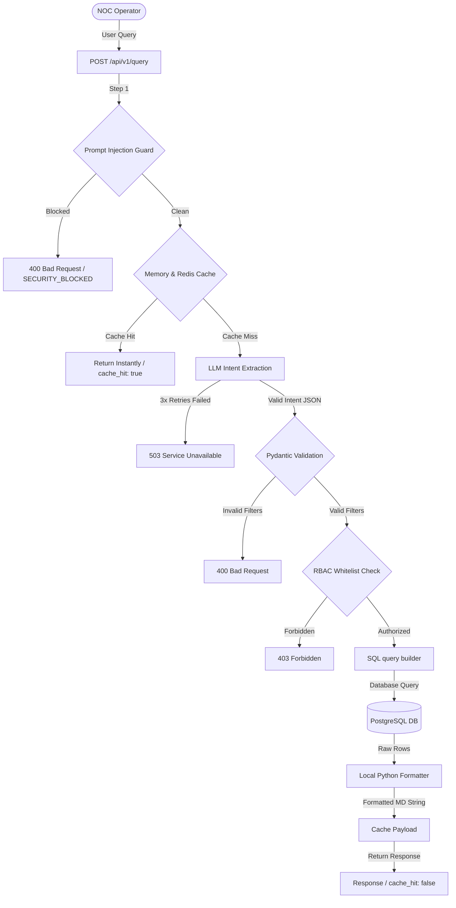

# Network AI Assistant

A production-grade, internal Network Operations Center (NOC) chat and automation assistant designed for enterprise networking teams. It is built with a fast **FastAPI (Python)** backend, a modern **React + Vite + Tailwind CSS** frontend, **PostgreSQL 16**, and integrated with **Google Gemini Flash** for natural language telemetry extraction.

---

## 🏗️ Core Architecture & Execution Flow

The system operates via a tightly integrated security and operational pipeline:



---

## 🔒 1. Authentication & Role-Based Access Control (RBAC)
- **JWT Session Security:** Logging in (`POST /api/v1/auth/login`) validates mock user details and returns a signed JSON Web Token (JWT) in a secure `httpOnly`, browser-inaccessible cookie (`access_token`), fully protecting the session from cross-site scripting (XSS) extraction.
- **Access Dependency:** Reusable `get_current_user` dependencies parse incoming request cookies, extracting standard identifiers (`username`, `role`).
- **Whitelisted RBAC Roles ([roles.py](file:///c:/Users/Administrator/OneDrive/Desktop/noc_asssitant_app/network-ai-assistant/backend/app/auth/roles.py)):**
  - **`admin`** — Full read-only and write telemetry permissions (all intents enabled).
  - **`network_operator`** — Standard NOC operator permissions whitelisted for status checking, inventory reviews, metrics, alarms, configuration changes, and uptimes.
  - **`network_engineer`** — Performance monitoring and audit log whitelists.
  - **`security_team`** — Safety auditing whitelists.

---

## ⚡ 2. Operational Query Execution Pipeline

When an operator submits a natural language question (e.g. *"Show devices CPU above 80%"*), the following server sequence is executed:

### Step 1: Prompt Injection & Chained SQL Guard
- Normalized requests are scanned case-insensitively against compiled security definitions (`blocked_patterns.py`).
- Matches on prompt extractions, system override commands, database schema probes (`information_schema`), or chained statements (`delete; drop`) immediately halt the pipeline.
- It logs a security warning with 16-character query hashes and commits a security block record to the `audit_log` database table with the detail `"BLOCKED:{pattern_type}"`, returning a `400 Bad Request` with code `SECURITY_BLOCKED`.

### Step 2: Telemetry Cache Verification
- The pipeline hashes request signatures `(user_role:query)` and performs a TTL lookup (30 seconds duration) in [cache.py](file:///c:/Users/Administrator/OneDrive/Desktop/noc_asssitant_app/network-ai-assistant/backend/app/query/cache.py).
- The cache supports automatic `REDIS_URL` discovery for multi-container deployments, falling back dynamically to memory caches.
- On a cache hit, the server responds in **~0-1ms**, returning the pre-packaged payload with `"cache_hit": true` at both the root level and within the timing block.

### Step 3: Generative Intent Extraction
- If the cache misses, the prompt is dispatched to Gemini Flash under strict generation constraints (`temperature=0`, `top_p=0.1`, `max_output_tokens=300`).
- The call is managed by a custom 3-attempt retry loop with progressive sleep delays (`0s` → `0.5s` → `1.0s`) to mitigate network failures or free-tier rate limits.
- The client automatically sanitizes Markdown code block formatting fences (e.g., ````json ... ````) returned by the AI before JSON decoding. Persistent API errors raise `IntentExtractionError` which maps into a clean `503 Service Unavailable` response.

### Step 4: Pydantic Validation & RBAC Gating
- Exporters validate extracted structures using Pydantic schema constraints (e.g., `DeviceMetricsFilters` asserting ranges for cpu/memory values).
- The server calls `has_permission(role, intent)`. Disallowed query intents raise a `403 Forbidden` early exit.

### Step 5: SQL Formulation & Execution
- Validated parameters are passed to `build_query` inside `sql_builder.py`.
- Metric column names and whitelisted operators are safely substituted using direct `.replace()` methods, avoiding `KeyError` exceptions on optional filter variables.
- Queries are executed asynchronously against the PostgreSQL database.

### Step 6: Zero-Latency Local response Formatter
- A pure Python responder (`response_templates.py`) parses raw database records into standard, highly detailed Markdown listings in **under 1ms**, completely bypassing the second Gemini formatting call.
- Uptime measurements are formatted into standard `Xd Xh Xm` notation.
- The formatted text is stored in the cache and returned with `"cache_hit": false`.

---

## 🖥️ 3. NOC Dashboard & Frontend Observability

The dashboard provides a premium terminal-themed view fitted with comprehensive real-time systems monitoring:

1. **Observability Header Pills:**
   - **AI Status Badge**: Glowing pulsing dot + `"AI ONLINE"`.
   - **DB Status Badge**: Cyan dot + `"DB CONNECTED"`.
   - **Role Display Badge**: Identifies logged-in operator permissions (e.g., standard operator in blue `NOC_OPERATOR`, administrator in red `ADMIN`).
   - **Performance Latency Badge**: Displays last successful query total delay in milliseconds, colored contextually (green < 1s, yellow 1-3s, red > 3s). Displays `—` when no queries have run.
2. **Timing Telemetry Badging:** Every assistant message bubble features a collapsible timing badge displaying sub-millisecond execution times for intent extraction, validation, database query, and deterministic response builders.
3. **Empty Chat Welcome Panel:** Centered dashboard workspace welcoming operators, showing active side-by-side indicator cards, and interactive suggested queries.
4. **Dynamic Data Grids:** Configured tabular output cards featuring custom device highlightings, IP matchings, and status coloring pills (`UP` in green, `DOWN` in red).
5. **Intelligent Error Interceptors:** Axios response interceptors catch backend HTTP failures (400, 401, 403, 429, 503, or connection drops) and translate them into friendly, clean warnings printed directly as cards inside the console feed, eliminating popups or alerts.

---

## 🚀 Quick Start

### 1. Build and Run via Docker
```bash
# Clone the repository
git clone <repo-url>
cd network-ai-assistant

# Create environment configuration
cp .env.example .env
# Edit .env and supply a valid GEMINI_API_KEY from Google AI Studio

# Build and launch containers
docker compose up --build -d
```
- **Frontend Portal:** available at <http://localhost>
- **Backend API Docs:** available at <http://localhost/api/v1/docs>

### 2. Manual Development Setup
```bash
# Run FastAPI Backend (From project root)
uvicorn backend.app.main:app --reload

# Run React/Vite Frontend (From frontend directory)
cd frontend
npm run dev
```

---
*Production-ready NetOps Operations Assistant.*
