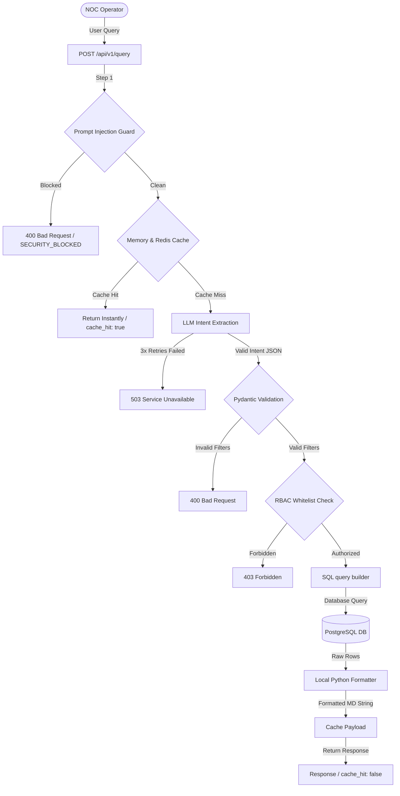

# 🔄 Pipeline Execution Flow

This document details the step-by-step lifecycle of a telemetry query as it moves from the operator's web browser, through the FastAPI safety controllers, down to the PostgreSQL database, and back to the user.

---

## 📈 Request Lifecycle Diagram

The pipeline coordinates strict validation, security parsing, role checking, database lookups, and fast formatting:



---

## 🚶 Step-by-Step Step Walkthrough

### 1. User Input & Transmission
The NOC Operator enters a natural language query in the chat console (e.g., *"Which switches are degraded in Chicago?"*). The frontend React container dispatches a `POST` request to the backend endpoint `/api/v1/query` containing the text message.

### 2. Prompt Injection Guard
Before parsing the text or engaging the LLM, the request passes through the **Prompt Injection Guard** (`prompt_guard.py`):
* Scans the query case-insensitively for 15 attack signatures (system override commands, prompt extraction attempts, SQL chain scripts, database system schema queries).
* **If flagged:** Commits a security log entry into the `audit_log` database table with the detail `"BLOCKED:{pattern_type}"`, logs a structured warning, and immediately aborts the transaction, returning an HTTP `400 Bad Request` with payload `{"error": "Request blocked by security policy.", "code": "SECURITY_BLOCKED"}`.

### 3. Telemetry Cache Verification
If the query is clean, the backend hashes the request signature using the operator's RBAC role and query text:
* Checks the TTL cache (30 seconds TTL duration).
* The caching layer (`cache.py`) attempts a Redis lookup. If Redis is unavailable, it falls back seamlessly to a local memory cache map.
* **If Cache Hits:** Bypasses Gemini entirely, returns the stored result in **~0ms**, and labels the response with `cache_hit: true`.

### 4. Generative Intent Extraction
On a cache miss, the raw message is sent to Google Gemini Flash using a strict system prompt:
* Gemini acts as a parser, translating human language into structured filter JSON.
* **Retry Loop:** A custom synchronous generator runs up to 3 attempts with progressive delays (`0s` $\rightarrow$ `0.5s` $\rightarrow$ `1.0s`) to survive network fluctuations or rate limits.
* **Response Sanitization:** Strips markdown block fences (e.g. ````json ... ````) returned by the AI before parsing. Persistent failure returns an HTTP `503 Service Unavailable`.

### 5. Pydantic Validation & RBAC Gating
* The parsed JSON parameters are loaded into Pydantic models (`intent_validator.py`). If the filters fail boundary validation, it returns an HTTP `400 Bad Request`.
* The validated intent is passed to the RBAC authorization module. If the operator's current JWT role does not have permission to query that specific intent table, the pipeline aborts and returns an HTTP `403 Forbidden`.

### 6. SQL Formulation
* The safe, validated parameters are passed to `sql_builder.py`.
* The builder loads the corresponding template from `sql_templates.py` and constructs the database statement using standard parameter binding placeholders (e.g., `:status` or `:device_type`).
* Explicit type casting is applied (e.g. `CAST(:severity AS VARCHAR) IS NULL`) to guarantee PostgreSQL compatibility when parameters are optional.

### 7. Asynchronous Query Execution
The query is executed asynchronously by the engine against the read-only PostgreSQL pool, respecting the global 5-second query execution timeout limit.

### 8. Local response Formatting
* The raw record rows are immediately dispatched to `response_templates.py`.
* A high-speed, deterministic Python builder constructs the final Markdown answer in **<1ms** (e.g., formatting uptimes, status codes, and table summaries).
* The final payload is stored in the cache and returned with `cache_hit: false` and a detailed sub-process timing dictionary.
